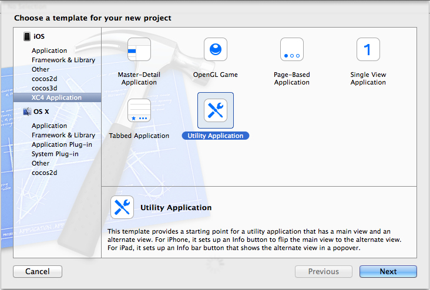

XCode4TemplateForXCode5
=======================

Create Xcode 4 style project on Xcode 5 with xib and iOS6 support

In Xcode 5, the default project template will create a new project using storyboard and use new API for iOS 7 only.

This repo ported older project under Xcode 4 to Xcode 5, so that you can easily create project that supports both iOS 6 and iOS 7.  It is useful if you want to:

1. Using xib instead of storyboard.
2. Support both iOS 6 and iOS 7.

Installation
------------

Copy "XC4 Installation" folder in this repo to:

	"~/Library/Developer/Xcode/Templates/Project Templates"

Restart Xcode, you should see a new item "XC4 Application"

